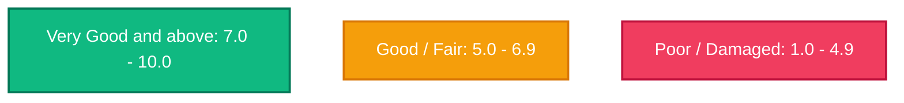

# GradeThread Brand Profile & Refreshed Design System

Welcome to the official design system, branding guidelines, and media kit for **GradeThread**. This document serves as the single source of truth for design, styling, and visual communications across the GradeThread React web platform, native iOS application, and press materials.

---

## 1. Brand Identity & Positioning

GradeThread is the standard-bearer for objective, AI-powered clothing condition assessment. We solve the "trust gap" in the pre-owned clothing economy.

*   **Our Mission**: To bring absolute transparency, consistency, and precision to the secondary apparel market, enabling frictionless commerce for resellers and buyers.
*   **Brand Pillars**:
    *   **Scientific Precision**: We replace subjective adjectives ("good condition") with objective data (1.0–10.0 scale, 5 weighted grading factors).
    *   **Integrated Workflow**: Reselling shouldn't happen in silos. GradeThread (via FlipDesk) aggregates cataloging, grading, listing, and finance in one seamless hub.
    *   **Trust Infrastructure**: Our shareable, verifiable certificates are a passport of authenticity and quality for garments on any marketplace.
*   **Brand Voice**:
    *   **Authoritative & Professional**: We are the experts; our tone is objective, logical, and factual.
    *   **Tech-Forward & Premium**: We look and feel like state-of-the-art SaaS, not a simple utility.
    *   **Frictionless & Enabling**: We focus on speed, efficiency, and increasing margins for resellers.

---

## 2. Refreshed Design Tokens

Our revised color palette moves away from flat default colors to a **highly polished, HSL-tailored color system** designed for dark/light mode balance and premium micro-glows.

### A. Core Palette

| Color Name | Hex Code | HSL Coordinate | Primary Usage |
| :--- | :--- | :--- | :--- |
| **Obsidian Navy** | `#0C1E36` | `hsl(214, 64%, 13%)` | Brand anchor, headers, deep dark mode containers |
| **Vibrant Crimson** | `#F03D5F` | `hsl(348, 87%, 59%)` | High-impact highlights, primary CTA buttons, alerts |
| **Midnight Coal** | `#0E0E1A` | `hsl(240, 29%, 8%)` | Primary background for dark mode |
| **Pearl White** | `#FAFAFC` | `hsl(240, 10%, 98%)` | Primary background for light mode |
| **Ice Accent** | `#F0F4F8` | `hsl(210, 33%, 96%)` | Light-mode component backgrounds & subtle borders |

> [!warning] Obsidian Navy is near-black, so `bg-brand-navy` on a Button hides it
> A default shadcn `<Button>` is `bg-primary text-primary-foreground`. In **dark**
> mode `--primary` inverts to light and `--primary-foreground` becomes the navy —
> so adding `className="bg-brand-navy"` and nothing else lets tailwind-merge strip
> `bg-primary`, leaving near-black text on a near-black button. It is still in the
> DOM and still clickable; it simply cannot be seen. Light mode looks fine, which
> is why it ships.
>
> This was the whole of the "the Submit button disappears once the item is ready"
> report: the ready state added `bg-brand-navy` to the button.
>
> **Rule:** never put solid `bg-brand-navy` on a Button or Badge without
> `text-white`. Translucent tints (`bg-brand-navy/10`, `/5`, `/30`) are fine. And
> usually the right fix is to delete the override — the default primary button
> already *is* the primary-action style, with correct contrast in both themes.

### B. Semantic Grading Tiers (Visual Language)

Rather than binary green/orange/red styling, GradeThread assigns specialized visual weight and glowing accents to each grading tier:



*   **Very Good and above (7.0–10.0)**:
    *   **Color**: **Emerald Mint** (`#10B981` / `hsl(162, 84%, 39%)`)
    *   **Visual Style**: Soft emerald border glows, high-contrast badges. Signifies a garment a buyer can trust.
*   **Good & Fair (5.0–6.9)**:
    *   **Color**: **Amber Gold** (`#F59E0B` / `hsl(38, 92%, 50%)`)
    *   **Visual Style**: Warm amber/gold indicators indicating standard vintage/pre-owned wear.
*   **Poor & Damaged (1.0–4.9)**:
    *   **Color**: **Crimson Red** (`#F03D5F` / `hsl(348, 87%, 59%)`)
    *   **Visual Style**: Strong red warnings indicating notable cosmetic or structural defects.

> [!important] Three bands, not four. Steel Navy is not a grade colour.
> Decided by the owner on 2026-09-04, closing US-3010 AC6. This section used to
> define a fourth band, **Steel Navy #0F3460 for 7.0–9.0**, and only the two
> phones ever implemented it. The web had shipped three bands since US-605
> consolidated the ladder out of "6+ files", so every grade from 7.0 to 9.4 —
> the ordinary band most resale garments land in — was GREEN on a laptop and
> NAVY on a phone. The web's shape won because it is what sellers have been
> looking at, and because Steel Navy is the primary surface colour: a grade
> drawn in it competes with every navy chrome element around it, and on a dark
> surface it was 1.36:1 against the background.
>
> **The band boundary is inclusive at 7.0** and lines up with `GRADE_TIER_BANDS`
> in `src/lib/constants.ts`, where 7.0 is the floor of "Very Good". The web used
> to test `> 7`, which put a 7.0 "Very Good" in amber next to a 5.0 "Fair" and
> split one tier across two colours; that off-by-one was corrected in the same
> commit.

> [!warning] The Crimson Red hex above is the SURFACE value. Do not use it as text.
> `#F03D5F` is 3.79:1 on white and fails WCAG AA. US-439 deepened the text value
> to `#cc1f3d`, which the web (`text-brand-red-text`) and Android
> (`colorScheme.error`) both use. iOS still draws grade text in the spec value
> and mitigates with per-tier SF Symbols and a `contrast:high` asset variant.
> Following this line literally re-introduces a defect its own consumers fixed.

### C. Typography

*   **Display Font**: **Outfit** (Geometric Sans-Serif)
    *   *Usage*: Landing page headlines, primary dashboard section headers, grade certificates titles.
    *   *Characteristics*: Sophisticated, geometric, premium tech feel.
*   **Body & UI Font**: **Inter** (Modern Neo-Grotesque)
    *   *Usage*: Data grids, table rows, form inputs, configuration pages.
    *   *Characteristics*: Monospaced tabular figures, highly legible at small sizes.

---

## 3. UI/UX Design Guidelines

To deliver a premium, "wow" factor, GradeThread interfaces must adhere to these structural styling practices.

### A. Glassmorphism & Depth
*   Use transparent backgrounds combined with heavy backdrop blurs for landing page cards and modal windows:
    ```css
    background: rgba(255, 255, 255, 0.03);
    backdrop-filter: blur(12px);
    border: 0.5px solid rgba(255, 255, 255, 0.1);
    box-shadow: 0 8px 32px 0 rgba(0, 0, 0, 0.2);
    ```
*   Use subtle, colored radial glows behind hero text and certificates to add lighting and depth to the dark mode layout.

### B. Micro-Animations & Interactivity
*   All state transitions must use a smooth cubic-bezier timing curve:
    *   `transition: all 300ms cubic-bezier(0.16, 1, 0.3, 1)`
*   Interactive elements (buttons, selection grid rows) should scale down slightly on click/tap:
    *   `transform: scale(0.98)`
*   Hover states should feature a subtle expansion of borders or a light glow transition.

### C. Shimmer Skeleton Loading
*   Avoid loading spinners for main content grids. Use a structural shimmer effect:
    *   *CSS*: A repeating linear gradient shifting from the muted background to a 50% lighter shade, animated infinitely from left-to-right (`bg-gradient-to-r from-muted via-muted/40 to-muted animate-shimmer`).

---

## 4. Native iOS App Styling & Sensory Guidelines

Our native Swift target coordinates with the web system but optimizes for platform-specific capabilities.

### A. Color Extension Mapping
Color tokens are mapped in Swift using Asset Catalog catalogs to support high-contrast and light/dark switching automatically:
```swift
extension Color {
    static let brandNavy = Color("BrandNavy")       // #0C1E36 / #0F3460
    static let brandRed = Color("BrandRed")         // #F03D5F
    static let brandEmerald = Color("BrandEmerald") // #10B981 (Mint/Pristine)
    static let brandAmber = Color("BrandAmber")     // #F59E0B (Amber/Good)
}
```

### B. Haptic Feedback Profiles
Tactile responses elevate the experience of condition intake and grades processing:
*   **Intake Photo Capture**: Light impact feedback on shutter trigger.
*   **Successful Grade Complete**: Centralized `Success` notification feedback (`UINotificationFeedbackGenerator.FeedbackType.success`).
*   **Overage Alert/Error**: Centralized `Error` notification feedback.
*   **List Selection / Toggles**: Subtle, battery-conscious selection feedback (`UISelectionFeedbackGenerator`).

### C. Reselling Widget Design Concepts
*   **Grade Status Widget (Small/Medium)**: Displays the grading queue count, average grade (using the dynamic `GradeScale` colors), and a circular ring tracking hours left in the current SLA.
*   **Sales/Margins Widget (Medium/Large)**: Displays weekly gross profit and margin percentages using Sparkline micro-graphs with a clean brand navy accent.

---

## 5. Media & Assets Press Kit

### A. Logo Specifications
*   **Primary Logo**: Dark wordmark on light backgrounds.
    *   *Specifications*: Obsidian Navy (`#0C1E36`) font mark with Crimson Red (`#F03D5F`) accent.
*   **Reverse Logo**: White wordmark on dark backgrounds.
    *   *Specifications*: Absolute White (`#FFFFFF`) with Crimson Red (`#F03D5F`) accent.
*   **Icon (GT Monogram)**: Monogram square with rounded edges (16.2% border radius). Used for PWA and iOS home screens.
*   **Clear Space Rule**: Ensure clear space around the logo equivalent to at least the height of the "G" character.

### B. Product Boilerplate (Press / Partnerships)
> **About GradeThread**: GradeThread is an AI-powered SaaS platform providing standardized condition grading for pre-owned clothing. By combining advanced Claude Vision AI models with a comprehensive reseller catalog (FlipDesk), GradeThread translates subjective wear descriptions into objective 1.0–10.0 condition scores and shareable authenticity certificates. GradeThread enables resellers to build buyer trust, reduce return ratios by up to 40%, and scale listings with automated comp analysis. GradeThread is operated by Pearson Media LLC.
